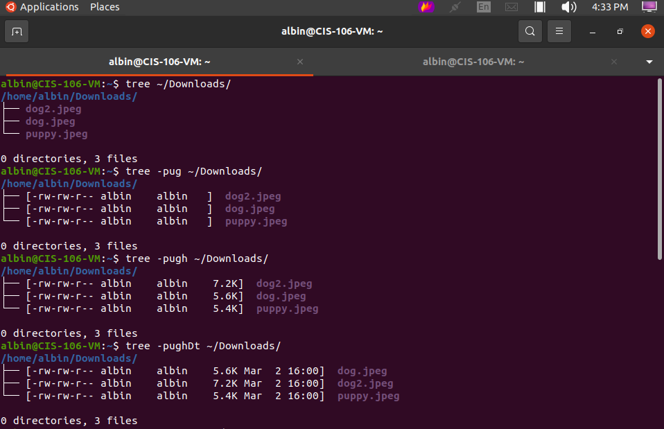

# Lab 3 | Installing software and navigating the file system | Answers
Assignment description [here](https://raw.githubusercontent.com/ra559/cis106/main/labs/lab3.md)

## Question 1
1. Which command did you use to search for the themes and to install them?

apt search theme, sudo apt install yuyo-gtk-theme

1. Which commands did you use to find and install the web browser?
apt search browser, sudo apt install zeal
3.1 What is the name of the package?

zeal

3.2 What dependencies are needed in order to install the package? (you can either take a screenshot of the terminal or copy and paste from the terminal)

 apport-symptoms guile-2.2-libs libevent-2.1-7
  libgc1c2 libgnome-games-support-1-3
  libgnome-games-support-common libnatpmp1
  libqqwing2v5 python3-systemd

3.3 How much disk space will the package utilize after installation?

65.7 MB of disk space
 

## Question 2

## Question 3

## Question 4

## Question 5
