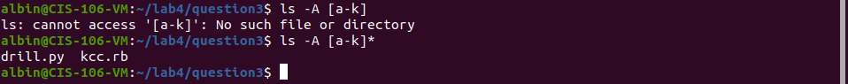

* Question 1 Problem 1

* Question 1 Problem 2

* Question 1 Problem 3

* Question 1 Problem 4

* Question 1 Problem 5 

* Question 2 Problem 1

* Question 2 Problem 2

* Question 2 Problem 3

* Question 2 Problem 4

* Question 3 Problem 1

* Question 3 Problem 2

* Question 3 Problem 3

* Question 3 Problem 4

* Question 4 Problem 1

* Question 4 Problem 2

* Question 4 Problem 3

* Question 4 Problem 4

* Question 4 Problem 5

* Question 4 Problem 5 Pt 2
 